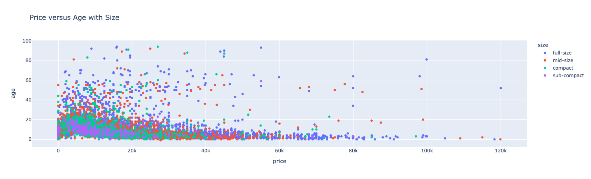
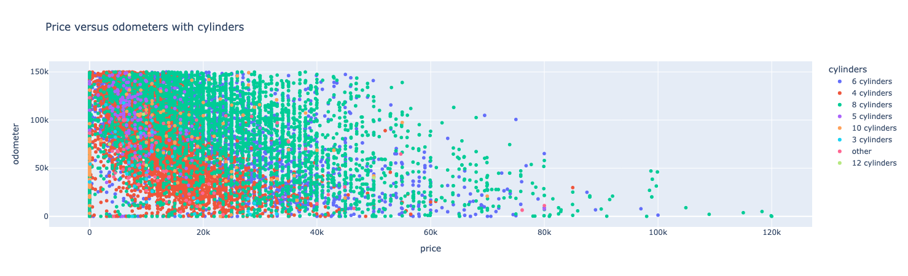

# Required Assignment 11.1: What Drives the Price of a Car? 

## Business Problem
The goal of this exercise is to understand the factors that most affect the price of used car. This information will be used to help clarify what users value in a used car. 

## Modeling & Developer Notes
I tried a number of number of models (see table below). While the ridge model performed well, the lasso model provided a 15% improvement in reducing loss.

| model    | training MAE | training MSE | test MAE | test MSE |
| -------- | ------- | ------- | ------- | ------- |
| just odometer | 9342.8 | 159092700.4 | 9418.0 | 164926412.2 |
| odometer and year | 9093.8 | 153955237.7 | 9304.6 | 386869778.4 |
| odometer, year, condition, and clean-title | 9051.0 | 152482904.9 | 9333.5 | 640393811.8 |
| odometer, year, condition, and clean-title (with scaling) | 8546.8 | 141055946.8 | 8588.1 | 160307678.3 |
| odometer, year, condition, and clean-title (with ridge) | 8786.2 | 146042308.2 | 8812.8 | 151776220.9 |
| lasso | 8374.1 | 111339849.7 | 7249.5 | 81741339.2 |
| ridge with 10000.0 | 7568.8 | 86496748.0 | 8395.0 | 115692944.4 |

The notebook for this is available: [used-cars.ipynb](used-cars.ipynb). 

## Findings
Based on the modeling, the following categories were shown to have :
Newer model, full sized cars have a _slightly positive correlation_ with higher vehicle cost. Cars with 8 cylinders have a higher correlation with diesel cars having the highest correlation. See the following chart for more information. 

Higher mileage, gas automatic cars have an extremely _highly negative correlation_ with vehicle cost. See the above chart for more information

Higher mileage, 4 cylinder cars have a _slightly negative correlation_ with a higher vehicle cost. The following chart bears this out

## Next Steps
Due to the size of the overall available dataset, the training and the feature set were greatly reduced. Any further work would need to add in the missing features (manufacturer, drive, and color) which would allowed for a more nuanced view of the data. Also, increasing the size of the overall training set from 100 to the full 35k would also yield a more accurate model. 

As there are a large number of manufacturers (40+), grouping them into segments (foreign, luxury, domestic, etc) would provide valuable insight. 
